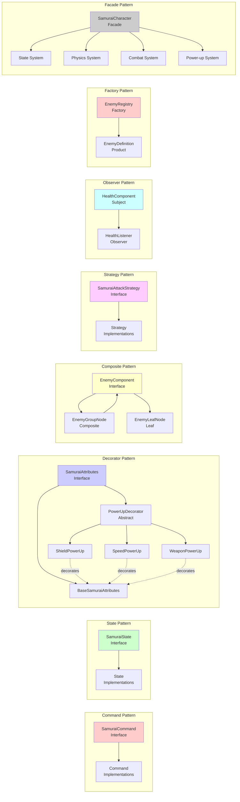
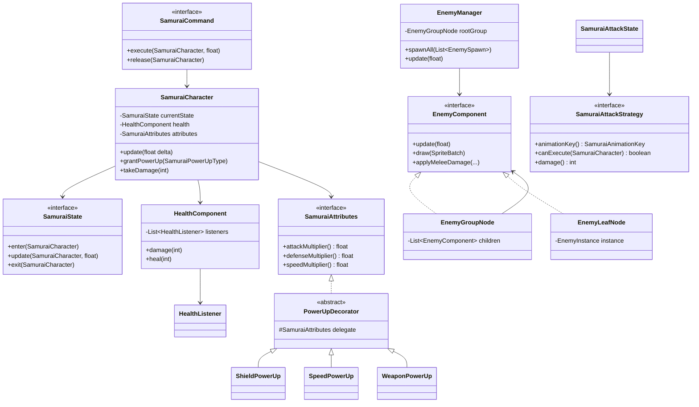
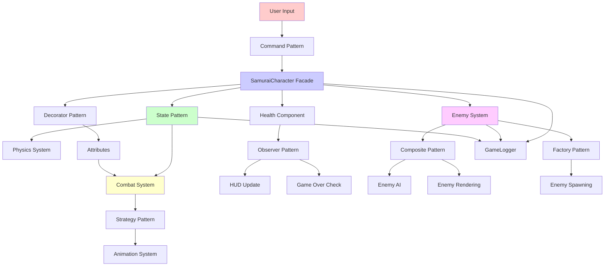
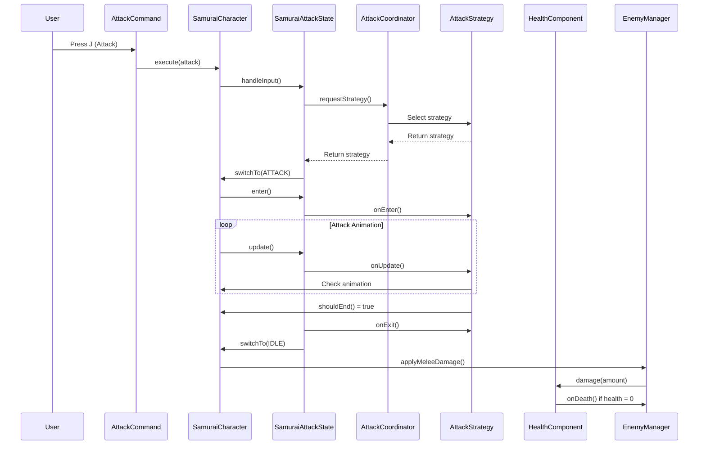
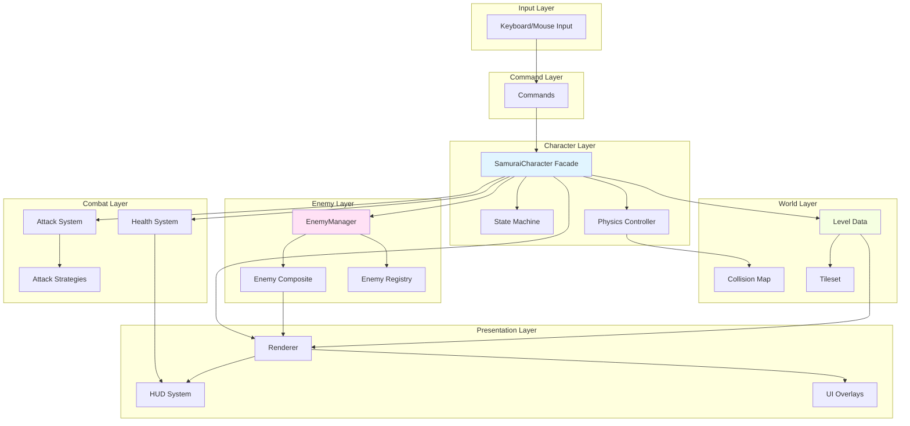
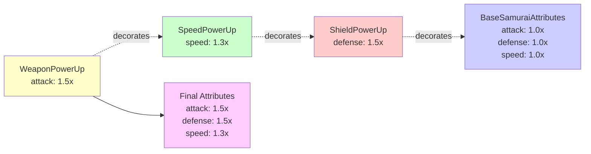
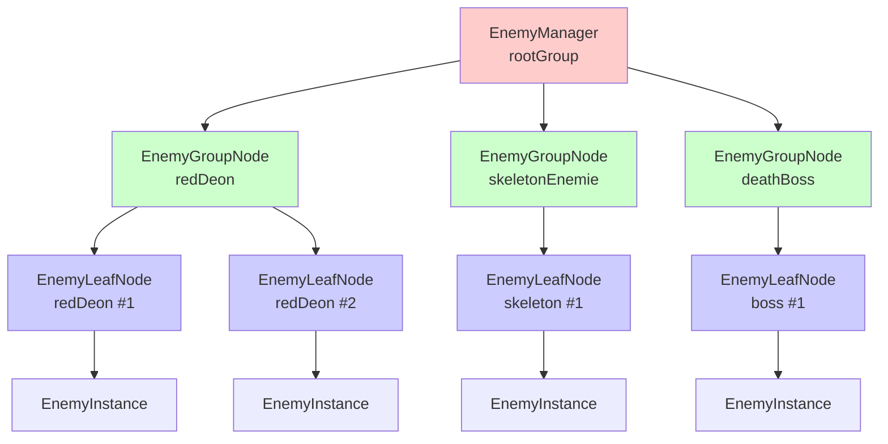

# Architecture Diagram
## Celeste-like Platformer Game Engine

This document contains Mermaid diagrams illustrating the system architecture and design patterns.

---

## System Architecture Overview

```mermaid
graph TB
    subgraph "Application Layer"
        DL[DesktopLauncher]
        EL[EditorLauncher]
        IL[InspectorLauncher]
    end
    
    subgraph "Game Core"
        CG[CelesteGame]
        GS[GameState]
    end
    
    subgraph "Character System"
        SC[SamuraiCharacter<br/>Facade]
        SKC[SamuraiKinematicController]
        HC[HealthComponent]
        SA[SamuraiAttributes]
    end
    
    subgraph "State System"
        SS[SamuraiState Interface]
        SIS[SamuraiIdleState]
        SRS[SamuraiRunState]
        SAS[SamuraiAttackState]
        SJS[SamuraiJumpState]
        SDS[SamuraiDashState]
    end
    
    subgraph "Command System"
        CMD[SamuraiCommand Interface]
        MLC[MoveLeftCommand]
        MRC[MoveRightCommand]
        JC[JumpCommand]
        AC[AttackCommand]
        DC[DashCommand]
    end
    
    subgraph "Combat System"
        SAC[SamuraiAttackCoordinator]
        SAS2[SamuraiAttackStrategy]
        GA1[GroundAttackOneStrategy]
        GA2[GroundAttackTwoStrategy]
        GA3[GroundAttackThreeStrategy]
        AA[AirAttackStrategy]
    end
    
    subgraph "Power-up System"
        PSA[PowerUpDecorator]
        SPU[ShieldPowerUp]
        SPU2[SpeedPowerUp]
        WPU[WeaponPowerUp]
        BSA[BaseSamuraiAttributes]
    end
    
    subgraph "Enemy System"
        EM[EnemyManager]
        EC[EnemyComponent Interface]
        EGN[EnemyGroupNode<br/>Composite]
        ELN[EnemyLeafNode<br/>Leaf]
        EI[EnemyInstance]
        ER[EnemyRegistry<br/>Factory]
    end
    
    subgraph "World System"
        LD[LevelData]
        LCM[LevelCollisionMap]
        TIO[TilesetIO]
    end
    
    subgraph "Logging"
        GL[GameLogger]
    end
    
    DL --> CG
    EL --> MapEditorApp
    IL --> MapInspector
    
    CG --> SC
    CG --> EM
    CG --> LD
    CG --> GS
    
    SC --> SKC
    SC --> HC
    SC --> SA
    SC --> SS
    
    SS --> SIS
    SS --> SRS
    SS --> SAS
    SS --> SJS
    SS --> SDS
    
    CG --> CMD
    CMD --> MLC
    CMD --> MRC
    CMD --> JC
    CMD --> AC
    CMD --> DC
    
    CMD --> SC
    
    SAS --> SAC
    SAC --> SAS2
    SAS2 --> GA1
    SAS2 --> GA2
    SAS2 --> GA3
    SAS2 --> AA
    
    SA --> PSA
    PSA --> SPU
    PSA --> SPU2
    PSA --> WPU
    SA --> BSA
    
    EM --> EC
    EC --> EGN
    EC --> ELN
    ELN --> EI
    EM --> ER
    
    HC --> HealthListener
    SC --> GL
    EM --> GL
    
    style SC fill:#e1f5ff
    style EM fill:#ffe1f5
    style CG fill:#f5ffe1
    style SS fill:#fff5e1
    style CMD fill:#e1fff5
```

---

## Design Patterns Diagram

---

## Class Relationships

---

## Data Flow Diagram

---

## Sequence Diagram: Attack Flow

---

## Component Interaction

---

## Power-up Decorator Chain

---

## Enemy Composite Structure

---

These diagrams illustrate the complete architecture of the game engine, showing how all design patterns interact and how the system components are organized.

